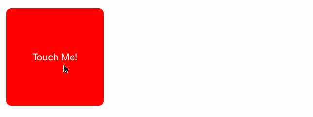
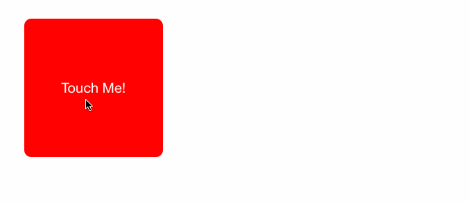

# AnimJS
[English Readme](./README.md)

可以用于所有Javascript框架的动画脚本

用到了 bezier-easing: https://github.com/gre/bezier-easing






## 使用Anim.js在React或者ReactNative项目
### 1.下载并引用Anim.js
```
import Anim from './Anim.js'
```

### 2.绑定this.state数据在组件上
```
render() {
  return (
    <div style={{
      transform: `translateX(${this.state.x}px)`,
      width: 200,
      height: 200,
      backgroundColor: '#f00',
      color: '#fff',
    }}
      onClick={this.handleClick}
    >
      Touch Me!
    </div>
  )
  handleClick = ()=>{}
}
```
### 3.使用Anim.js修改this.state.x
```
handleClick = () => {
  let move = Anim.init(0.5, (p) => {
    this.setState({
      x: Anim.motion(0, 100, p)
    })
  })
  move.play()
}
```

## API列表

### Anim.init()
> Anim.init(时间, 方法)
```
let an = Anim.init(0.3, (value)=>{console.log(value)})
an.play(()=>{console.log('动画结束回调')})
```
value is 0~1 in 0.3 second

### Anim.motion()
> Anim.motion(开始值, 结束值, 系数)
```
let an = Anim.init(0.3, (value)=>{
  let per = Anim.motion(50, 150, value)
  console.log(per)
})
an.play()
```

### Anim.ease 曲线动画
```
let an = Anim.init(0.3, (value)=>{
  let per = Anim.motion(50, 150, value)
  console.log(per)
})
an.easing = Anim.ease.spring
//or
an.easing = [0.25, 0.5, 0.7, 1]
an.play()
```

### delay(延迟), yoyo(回到原位), replay(重复), play(播放动画), stop(停止动画)
```
an.delay = 10
an.yoyo = true
an.replay = 10
an.play()
```

### play(回调函数), stop()
```
an.play(()=>{console.log('动画已经结束')})
an.stop()
```
